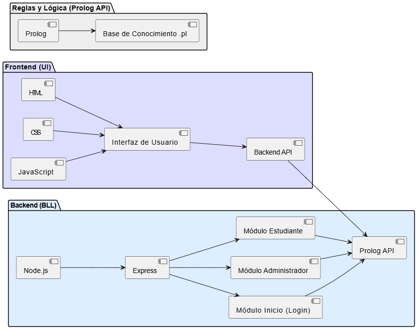

#### Universidad de San Carlos de Guatemala
#### Facultad de Ingeniería
#### Escuela de Ciencias y Sistemas
#### Inteligencia Artificial
#### Ing. LUIS FERNANDO ESPINO BARRIOS
#### Auxiliar: ROBIN OMAR BUEZO DÍAZ
<br><br><br><br><br><br><br>
<p style="text-align: center;"><strong> Proyecto 1: UniMatch <br>
</strong></p>
<br><br><br><br><br><br><br>

| Nombre                              | Carnet    |
| :---:                               |  :----:   |
| Eduardo Alexander Reyes Gonzalez    | 202010904 |
| Pedro Martin Francisco              | 201700656 |
| Luis Antonio Cutzal Chalí           | 201700841 |

# Objetivos
## Objetivo general
Desarrollar un sistema inteligente basado en lógica computacional que asista a los usuarios en la
identificación de la facultad, carrera universitaria y horario más adecuado según sus aptitudes,
habilidades, intereses y preferencias, utilizando Tau-Prolog para el razonamiento lógico


## Objetivos específicos
- Implementar una base de conocimientos en Prolog que almacene información sobre
facultades, carreras, los perfiles recomendados para cada una y los horarios de los cursos.
- Diseñar e integrar una interfaz web interactiva con HTML, CSS y JavaScript para facilitar la
interacción del usuario con el sistema.
- Desarrollar un motor de inferencia en Tau-Prolog que analice las respuestas del usuario y
determine la mejor coincidencia de carrera, facultad y horario de cursos.

# Descripcion del problema
<p style="text-align: justify;">
La Universidad de San Carlos de Guatemala ha identificado que un porcentaje de sus estudiantes
cambia de carrera en algún momento de su trayectoria académica o, en muchos casos, abandona
sus estudios debido a una elección inicial poco acertada o complicaciones con los horarios. Esto
se debe, en gran parte, a la poca planificación de horarios o la falta de orientación adecuada en
la selección de una carrera que realmente se alinee con sus aptitudes, habilidades, intereses y
preferencias.

<p style="text-align: justify;">
Ante esta problemática, la Facultad de Ingeniería ha solicitado a los estudiantes del curso de
Inteligencia Artificial 1 el desarrollo de un sistema inteligente que ayude a los futuros
universitarios a tomar decisiones más informadas. Este sistema aplicará un análisis lógico
avanzado para evaluar el perfil del estudiante y, con base en criterios predefinidos, recomendará
las facultades y carreras que mejor se ajusten a sus características personales. Además, les
ayudará también a poder definir el horario que se ajuste mejor según los cursos que deban cursar.

<p style="text-align: justify;">
El objetivo es proporcionar una herramienta de apoyo que permita a los estudiantes realizar una
elección académica más acertada, reduciendo así la tasa de deserción y cambios de carrera, y
fomentando un desarrollo profesional alineado con sus fortalezas y aspiraciones.
</p>

# Arquitectura del sistema




# Componentes clave
## Módulo de Inicio (Login)
- Propósito: Proveer una introducción al sistema y permitir el acceso al módulo de estudiantes o al administrador con credenciales predefinidas.
- Componentes:
    - Pantalla de bienvenida: Información general sobre el sistema.
    - Navegación: Botones para acceder al módulo de estudiantes o al administrador.
    - Backend: Validación de credenciales para el administrador y redirección de usuarios al módulo correspondiente.
## Módulo de Estudiantes
- Propósito: Facilitar el análisis de compatibilidad con facultades y carreras y ayudar en la planificación de horarios de cursos.
- Componentes:
    - Formulario de entrada: Listas desplegables o checkboxes para seleccionar aptitudes, habilidades, intereses, y escalas de afinidad.
    - Análisis de compatibilidad: Procesamiento de la información ingresada para generar carreras recomendadas.
    - Visualización de resultados: Listado de facultades y carreras recomendadas, con gráficos de compatibilidad.
    - Planificación de horarios: Selección de cursos y análisis de horarios óptimos.
    - Backend: Procesamiento de la información del estudiante, generación de resultados y optimización de horarios.
    - Frontend: Presentación de los resultados de análisis y horarios en tablas y gráficos fáciles de entender.
## Módulo Administrativo
- Propósito: Administrar y gestionar las opciones académicas, las aptitudes, habilidades, intereses, y cursos del sistema, y cargar/descargar archivos de reglas en formato .pl.
- Componentes:
    - Pantalla de gestión: Panel de administración con diversas secciones.
    - Gestión de facultades y carreras: Agregar, editar, eliminar facultades y carreras, y actualizar criterios de afinidad.
    - Gestión de aptitudes, habilidades e intereses: Añadir, editar, eliminar características, y asociarlas con facultades y carreras.
    - Gestión de cursos y horarios: Agregar, editar, eliminar cursos y horarios, y relacionarlos con facultades.
    - Carga y descarga de archivo .pl: Interfaz para cargar el archivo de reglas en Tau-Prolog y descargarlo con las modificaciones realizadas.
    - Backend: Administración de las bases de datos y procesamiento de las modificaciones hechas por el administrador.
    - Frontend: Interfaces de gestión amigables para el administrador.

# Configuración del entorno
## Editor de código
- Usa un editor de código que te ayude a escribir, depurar y organizar tu proyecto, como Visual Studio Code (VS Code)
## Estructura de carpetas
- Organiza tu proyecto en carpetas para mantener los archivos ordenados.

```json
/IA1_1S2025_P1_G3
    /css
        /adimin.css
        /analisis_carrera.css
        /asociacion_admin.css
        /asociaciones_carrera_admin.css
        /cursos_horarios.css
        /gestion_habilidades_interes_admin.css
        /home_estudiante.css
        /seccion_horario.css
        /styles.css
    /js
        /admin.js
        /analisis_carrera.js
        /animacion_y_navegacion.js
        /AsociacionAdmin.js
        /asociaciones_carrera_admin.js
        /cursosHorarios.js
        /gestion_habilidades_intereses_admin.js
        /horario.js
        /index.js
        /seccion_horario.js
        /tau-prolog.js
    /knowledge_base
        /admin.pl
        /base_conocimiento.pl
    /Admin.html
    /analisis_carrera.html
    /asociacion_admin.html
    /asociaciones_carrera_admin.html
    /CursosHorarios.html
    /Gestion_habilidades_intereses_admin.html
    /Home_estudiante.html
    /Horario.html
    /index.html
    /seccion_horario.html
```

# Proceso de carga

```html
            <label for="fileInput" id="ADMIN_TEXTO_ARCHIVO">Cargar archivo Prolog:</label>
            <input type="file" id="fileInput" accept=".pl">
```

```js
let session = pl.create(1000);
let CodigoProlog = "";

window.onload = function () {
    validar_codigo_prolog();
    if (sessionStorage.getItem("CODIGO_PROLOG")) {
        cargarDatosDesdeSessionStorage();
    }
};

//   Función para validar y mostrar el código Prolog
function validar_codigo_prolog() {
    try {
        CodigoProlog = sessionStorage.getItem("CODIGO_PROLOG");
        if (!CodigoProlog) {
            return;
        }
        document.getElementById("STATUS_PROLOG").style.backgroundColor = "green";
        procesarCodigoProlog(CodigoProlog);  //   Procesa los datos después de cargarlos
    } catch (error) {
        console.log("ERROR AL OBTENER CÓDIGO PROLOG", error);
    }
}

//   Función para cargar archivo Prolog
document.getElementById('fileInput').addEventListener('change', function (event) {
    const file = event.target.files[0];
    if (!file) return;
    const reader = new FileReader();
    reader.onload = function (e) {
        CodigoProlog = e.target.result;
        session = pl.create(1000);
        session.consult(CodigoProlog, {
            success: function () {
                document.getElementById("STATUS_PROLOG").style.backgroundColor = "green";
                sessionStorage.setItem("CODIGO_PROLOG", CodigoProlog);
                procesarCodigoProlog(CodigoProlog); //   Procesar datos después de cargarlos
            },
            error: function (err) {
                console.log("Error al cargar el código: " + err);
            }
        });
    };
    reader.readAsText(file);
});
```

# Edición del archivo .pl
```pl
% Facultades -> facultad_unico
facultad_unico('ingenieria').
facultad_unico('medicina').

% Carreras
carrera('ciencias y sistemas').
carrera('civil').
carrera('electronica').
carrera('industrial').
carrera('economicas').
carrera('derecho').
carrera('matematicas').
carrera('quimica').
carrera('biologia').
carrera('ciencias politicas').
carrera('odontologia').
carrera('nutricion').
carrera('mecanica').
carrera('comunicacion').
carrera('administracion').

% Aptitudes -> aptitud_unico
aptitud_unico('pensamiento_logico').
aptitud_unico('analisis_cuantitativo').
aptitud_unico('creatividad').
aptitud_unico('conocimientos_en_matematicas').
aptitud_unico('trabajo_en_equipo').
aptitud_unico('resolucion_de_problemas').
aptitud_unico('atencion_al_detalle').
aptitud_unico('pensamiento_critico').
aptitud_unico('conocimientos_en_programacion').
aptitud_unico('capacidad_para_aprender_rapidamente').
aptitud_unico('habilidades_comunicativas').
aptitud_unico('conocimientos_en_fisica').
aptitud_unico('modelado_y_simulacion').


% Cursos
curso_unico('programacion_1').
curso_unico('estructuras_de_datos').
curso_unico('resistencia_de_materiales').
curso_unico('dibujo_tecnico').
curso_unico('circuitos_electricos').
curso_unico('electronica_digital').

% Dias esto quemado en el front
dia('lunes').
dia('martes').
dia('miercoles').
dia('jueves').
dia('viernes').
dia('sabado').

% Horas disponibles esto quemado en el front
hora('08:00').
hora('10:00').
hora('12:00').
hora('14:00').
hora('16:00').
hora('18:00').

% Asociacion de facultades con carreras

% Facultades - Carreras  -> facultad 
facultad('ingenieria', 'ciencias y sistemas').
facultad('ingenieria', 'civil').
facultad('ingenieria', 'electronica').
facultad('ingenieria', 'industrial').
facultad('ingenieria', 'mecanica').
facultad('ingenieria', 'quimica').

% Asociacion de aptitudes con carreras

% Ingenieria - Ciencias de Sistemas -> aptitud -> primero la aptitud y luego la carrera

aptitud('pensamiento_logico', 'ciencias y sistemas').
aptitud('analisis_cuantitativo','ciencias y sistemas').
aptitud('conocimientos_en_programacion','ciencias y sistemas').
aptitud('trabajo_en_equipo','ciencias y sistemas').
aptitud('resolucion_de_problemas','ciencias y sistemas').
aptitud('habilidades_comunicativas','ciencias y sistemas').

% Ingenieria - Civil -> primero la aptitud y luego la carrera
aptitud('creatividad','civil').
aptitud('trabajo_en_equipo','civil').
aptitud('resolucion_de_problemas','civil').
aptitud('atencion_al_detalle','civil').
aptitud('conocimientos_en_fisica','civil').
aptitud('habilidades_comunicativas','civil').

% Ingenieria - Electronica -> primero la aptitud y luego la carrera
aptitud('pensamiento_logico','electronica').
aptitud('analisis_cuantitativo','electronica').
aptitud('modelado_y_simulacion','electronica').
aptitud('trabajo_en_equipo','electronica').
aptitud('resolucion_de_problemas','electronica').

% habilidades

habilidad_unica('Analisis de datos').
habilidad_unica('programacion').
habilidad_unica('investigacion cientifica').
habilidad_unica('manejo de herramientas manuales').
habilidad_unica('redaccion').
habilidad_unica('negociacion').
habilidad_unica('edicion de audio/video').
habilidad_unica('gestion de proyectos').
habilidad_unica('diseño grafico').

% habilidades -> carrera
habilidad('Analisis de datos','matematicas').
habilidad('programacion','matematicas').
habilidad('investigacion cientifica','quimica').
habilidad('investigacion cientifica','biologia').

habilidad('manejo de herramientas manuales','civil').
habilidad('programacion','ciencias y sistemas').
habilidad('Analisis de datos','ciencias y sistemas').
habilidad('Analisis de datos','industrial').

habilidad('Analisis de datos','economicas').
habilidad('redaccion','comunicacion').
habilidad('redaccion','derecho').
habilidad('negociacion','administracion').
habilidad('redaccion','ciencias politicas').
habilidad('investigacion cientifica','ciencias politicas').

habilidad('investigacion cientifica','medicina').
habilidad('manejo de herramientas manuales','odontologia').
habilidad('investigacion cientifica','nutricion').

% es
interes_unico('ciencias exactas').
interes_unico('ciencias naturales').
interes_unico('tecnologia').
interes_unico('ciencias sociales').
interes_unico('economia').
interes_unico('derecho').
interes_unico('politica').
interes_unico('comunicacion').
interes_unico('administracion').
interes_unico('arte y diseno').
interes_unico('humanidades').

% interes -> carrera
interes('ciencias exactas','matematicas').
interes('ciencias exactas','quimica').
interes('ciencias naturales','quimica').
interes('ciencias naturales','biologia').

interes('ciencias exactas','civil').
interes('tecnologia','electronica').
interes('ciencias exactas','industrial').
interes('tecnologia','industrial').

interes('ciencias sociales','economicas').
interes('economia','economicas').
interes('ciencias sociales','derecho').
interes('derecho','derecho').
interes('ciencias sociales','ciencias politicas').
interes('politica','ciencias politicas').

interes('ciencias naturales','medicina').
interes('ciencias naturales','odontologia').
interes('ciencias naturales','nutricion').

% preguntas

pregunta(p1,'en que tipo de entorno laboral se sentiria mas comodo').
pregunta(p2,'prefieres un enfoque de aplicacion practica o la investigacion teorica').
pregunta(p3,'prefieres trabajar con reglas claras o en un entorno que fomenta la creatividad').
pregunta(p4,'te gustaria trabajar en un entorno global o multicultural').

respuesta(p1,'trabajo individual').
respuesta(p1,'trabajo en equipo').
respuesta(p2,'enfoque teorico').
respuesta(p2,'enfoque practico').
respuesta(p3,'ambiente estructurado').
respuesta(p3,'ambiente creativo').
respuesta(p4,'ambiente internacional').
respuesta(p4,'ambiente local').

preferencia('ambiente estructurado','electronica').
preferencia('enfoque practico','electronica').
preferencia('trabajo en equipo','electronica').
preferencia('ambiente estructurado','ciencias y sistemas').
preferencia('enfoque practico','ciencias y sistemas').
preferencia('trabajo en equipo','ciencias y sistemas').
preferencia('ambiente estructurado','industrial').
preferencia('enfoque practico','industrial').
preferencia('trabajo en equipo','industrial').

preferencia('ambiente estructurado','matematicas').
preferencia('enfoque teorico','matematicas').
preferencia('trabajo individual','matematicas').
preferencia('ambiente estructurado','quimica').
preferencia('enfoque teorico','quimica').
preferencia('trabajo en equipo','quimica').
preferencia('ambiente estructurado','biologia').
preferencia('enfoque practico','biologia').
preferencia('trabajo en equipo','biologia').

preferencia('ambiente estructurado','economicas').
preferencia('enfoque practico','economicas').
preferencia('trabajo en equipo','economicas').
preferencia('ambiente estructurado','derecho').
preferencia('enfoque practico','derecho').
preferencia('trabajo en equipo','derecho').
preferencia('ambiente internacional','economicas').
preferencia('enfoque teorico','ciencias politicas').
preferencia('trabajo en equipo','administracion').

preferencia('ambiente estructurado','medicina').
preferencia('enfoque practico','medicina').
preferencia('trabajo en equipo','medicina').
preferencia('ambiente estructurado','odontologia').
preferencia('enfoque practico','odontologia').
preferencia('trabajo en equipo','odontologia').
preferencia('ambiente estructurado','nutricion').
preferencia('enfoque practico','nutricion').
preferencia('trabajo en equipo','nutricion').


% Asociar Carreras y Cursos -> primero es curso y luego carrera
curso('programacion_1','ciencias y sistemas').
curso('estructuras_de_datos','ciencias y sistemas').
curso('resistencia_de_materiales', 'industrial').
curso('dibujo_tecnico','civil').
curso('circuitos_electricos','electronica').
curso('electronica_digital','electronica').

% seccion
seccion_unico('A').
seccion_unico('B').
seccion_unico('C').
seccion_unico('D').
seccion_unico('E').

seccion('A','programacion_1').
seccion('B','programacion_1').
seccion('A','circuitos_electricos').
seccion('A','electronica_digital').
seccion('E','circuitos_electricos').
seccion('E','dibujo_tecnico').

% horario(dia, hora inicio, hora fin, seccion, carrera). y quemados en el front

horario('lunes', '08:00', '10:00', 'A','programacion_1').
horario('miercoles', '10:00', '12:00', 'A','circuitos_electricos').
horario('martes', '14:00', '16:00', 'A','circuitos_electricos').
horario('jueves', '16:00', '18:00', 'E','dibujo_tecnico').
horario('viernes', '08:00', '10:00', 'B','programacion_1').
horario('sabado', '10:00', '12:00', 'B','programacion_1').

limitar_decimales(N, Decimales, Redondeado) :-
    Factor is 10^Decimales,           % Crear el factor para mover el punto decimal
    Temp is N * Factor,               % Multiplicar el numero por el factor
    RedondeadoTemp is round(Temp),    % Redondear el numero
    Redondeado is RedondeadoTemp / Factor.  % Dividir por el factor para devolver el punto decimal a su lugar original

% Puntaje por aptitudes (FUNCIONA)
puntaje_aptitudes(Carrera, Puntaje) :-
    aptitudes_usuario(Aptitudes),
    contar_coincidencias_aptitudes(Aptitudes, Carrera, Coincidencias, TotalAptitudes),
    ( TotalAptitudes =:= 0 -> Puntaje = 0
    ; PuntajeSinLimitar is (Coincidencias / TotalAptitudes) * 100,
      limitar_decimales(PuntajeSinLimitar, 2, Puntaje)
    ).

% Contar Total de caracteristica (recursivo)
contar_coincidencias_aptitudes([], _, 0, 0).
contar_coincidencias_aptitudes([Aptitud | Resto], Carrera, Coincidencias, TotalAptitudes) :-
    contar_coincidencias_aptitudes(Resto, Carrera, CoincidenciasResto, TotalAptitudesResto),
    (aptitud(Aptitud, Carrera) -> Coincidencias is CoincidenciasResto + 1 ; Coincidencias is CoincidenciasResto),
    TotalAptitudes is TotalAptitudesResto + 1.


% Puntaje de habilidades (FUNCIONA)
puntaje_habilidades(Carrera, Puntaje) :-
    habilidades_usuario(Habilidades),
    contar_coincidencias_habilidades(Habilidades, Carrera, Coincidencias, TotalHabilidades),
    ( TotalHabilidades =:= 0 -> Puntaje = 0
    ; PuntajeSinLimitar is (Coincidencias / TotalHabilidades) * 100,
      limitar_decimales(PuntajeSinLimitar, 2, Puntaje)
    ).

% Contar coincidencias y total de habilidades (recursivo)
contar_coincidencias_habilidades([], _, 0, 0).
contar_coincidencias_habilidades([Habilidad | Resto], Carrera, Coincidencias, TotalHabilidades) :-
    contar_coincidencias_habilidades(Resto, Carrera, CoincidenciasResto, TotalHabilidadesResto),
    (habilidad(Habilidad, Carrera) -> Coincidencias is CoincidenciasResto + 1; Coincidencias is CoincidenciasResto),
    TotalHabilidades is TotalHabilidadesResto + 1.

% Puntaje de intereses (todo en una funcion)
puntaje_intereses(Carrera, Puntaje) :-
    intereses_usuario(Intereses),
    sumar_porcentajes_intereses(Intereses, Carrera, Puntaje).

% Sumar porcentajes de intereses (recursivo)
sumar_porcentajes_intereses([], _, 0).
sumar_porcentajes_intereses([(Interes, Porcentaje) | Resto], Carrera, Suma) :-
    sumar_porcentajes_intereses(Resto, Carrera, SumaResto),
    (interes(Interes, Carrera) -> Suma is SumaResto + Porcentaje; Suma is SumaResto).

% Puntaje de preferencias (todo en una funcion)
puntaje_preferencias(Carrera, Puntaje) :-
    preferencias_usuario(Preferencias),
    contar_coincidencias_preferencias(Preferencias, Carrera, Coincidencias, TotalPreferencias),
    ( TotalPreferencias =:= 0 -> Puntaje = 0
    ; Coincidencias =:= 0 -> Puntaje = 0
    ; PuntajeSinLimitar is (Coincidencias / TotalPreferencias) * 100,
    limitar_decimales(PuntajeSinLimitar, 2, Puntaje)
    ).

% Contar coincidencias y total de preferencias (recursivo)
contar_coincidencias_preferencias([], _, 0, 0).
contar_coincidencias_preferencias([(PreferenciaID, Respuesta) | Resto], Carrera, Coincidencias, TotalPreferencias) :-
    contar_coincidencias_preferencias(Resto, Carrera, CoincidenciasResto, TotalPreferenciasResto),
    ((respuesta(PreferenciaID, Respuesta), preferencia(Respuesta, Carrera)) ->
        Coincidencias is CoincidenciasResto + 1;
        Coincidencias is CoincidenciasResto
    ),
    TotalPreferencias is TotalPreferenciasResto + 1.

% Puntaje total de una carrera (recursivo)
puntaje_total(Carrera, PuntajeTotal) :-
    (puntaje_aptitudes(Carrera, PuntajeAptitudes) -> true ; PuntajeAptitudes = 0),
    (puntaje_habilidades(Carrera, PuntajeHabilidades) -> true ; PuntajeHabilidades = 0),
    (puntaje_intereses(Carrera, PuntajeIntereses) -> true ; PuntajeIntereses = 0),
    (puntaje_preferencias(Carrera, PuntajePreferencias) -> true ; PuntajePreferencias = 0),
    PuntajeSinLimitar is (PuntajeAptitudes + PuntajeHabilidades + PuntajeIntereses + PuntajePreferencias) / 4,
    limitar_decimales(PuntajeSinLimitar, 2, PuntajeTotal).

% Puntaje total de una facultad (todo en una funcion)
puntaje_facultad(Facultad, PuntajeTotal) :-
    findall(Carrera, facultad(Facultad, Carrera), Carreras),
    findall(Puntaje, (facultad(Facultad, Carrera), puntaje_total(Carrera, Puntaje)), PuntajesCarreras),
    sumar_puntajes_carreras(PuntajesCarreras, PuntajeSinLimitar),
    limitar_decimales(PuntajeSinLimitar, 2, PuntajeTotal).

% Sumar los puntajes de las carreras (recursivo)
sumar_puntajes_carreras([], 0).
sumar_puntajes_carreras([Puntaje | Resto], SumaTotal) :-
    sumar_puntajes_carreras(Resto, SumaParcial),
    SumaTotal is SumaParcial + Puntaje.

% ENCONTRAR LA LISTA DE FACULTADES
obtener_lista_facultades(Facul, LF) :-
    findall(Fac, facultad_unico(Fac), Facul),
    findall(Puntaje, (facultad_unico(Facu), puntaje_facultad(Facu, Puntaje)), LF).

% OBTENER LISTA DE CARRERAS
obtener_lista_carreras(Facult, LC) :-
    findall(Puntaje, (facultad(Facult, Carr), puntaje_total(Carr, Puntaje)), LC).
```
# Extraer y guardar los datos del archivo .pl
```js
//   Función para procesar Código Prolog y extraer datos
function procesarCodigoProlog(codigo) {
    let facultades = [], carreras = [], aptitudes = [], facultadCarrera = [], carreraAptitud = [], curso_unico_ = [];
    let dias = [], horas = [], habilidades_unicas = [], habilidades = [], intereses_unicos = [], intereses = [];
    let preferencias = [], secciones_unicos = [], seccion = [], horarios = [];
    let lineas = codigo.split("\n");

    lineas.forEach(linea => {
        linea = linea.trim();
        
        // Facultad única
        if (linea.startsWith("facultad_unico(")) {
            let facultad = linea.match(/facultad_unico\((.*?)\)/);
            if (facultad) facultades.push(facultad[1].slice(1, -1));
        }
        // Carrera
        else if (linea.startsWith("carrera(")) {
            let carrera = linea.match(/carrera\((.*?)\)/);
            if (carrera) carreras.push(carrera[1].slice(1, -1));
        }
        // Aptitud única
        else if (linea.startsWith("aptitud_unico(")) {
            let aptitud = linea.match(/aptitud_unico\((.*?)\)/);
            if (aptitud) aptitudes.push(aptitud[1].slice(1, -1));
        }
        // Curso único
        else if (linea.startsWith("curso_unico(")) {
            let curso_unico = linea.match(/curso_unico\((.*?)\)/);
            if (curso_unico) curso_unico_.push(curso_unico[1].slice(1, -1));
        }
        // Día
        else if (linea.startsWith("dia(")) {
            let dia = linea.match(/dia\((.*?)\)/);
            if (dia) dias.push(dia[1].slice(1, -1));
        }
        // Hora
        else if (linea.startsWith("hora(")) {
            let hora = linea.match(/hora\((.*?)\)/);
            if (hora) horas.push(hora[1].slice(1, -1));
        }
        // Habilidad única
        else if (linea.startsWith("habilidad_unica(")) {
            let habilidad_unica = linea.match(/habilidad_unica\((.*?)\)/);
            if (habilidad_unica) habilidades_unicas.push(habilidad_unica[1].slice(1, -1));
        }
        // Relación carrera-habilidad
        else if (linea.startsWith("habilidad(")) {
            let relacionCarreraHabilidad = linea.match(/habilidad\((.*?),\s*(.*?)\)/);
            if (relacionCarreraHabilidad) habilidades.push({ habilidad: relacionCarreraHabilidad[1], carrera: relacionCarreraHabilidad[2] });
        }
        // Interés único
        else if (linea.startsWith("interes_unico(")) {
            let interes_unico = linea.match(/interes_unico\((.*?)\)/);
            if (interes_unico) intereses_unicos.push(interes_unico[1].slice(1, -1));
        }
        // Relación carrera-interés
        else if (linea.startsWith("interes(")) {
            let relacionCarreraInteres = linea.match(/interes\((.*?),\s*(.*?)\)/);
            if (relacionCarreraInteres) intereses.push({ interes: relacionCarreraInteres[1], carrera: relacionCarreraInteres[2] });
        }
        // Preferencia
        else if (linea.startsWith("preferencia(")) {
            let preferencia = linea.match(/preferencia\((.*?)\)/);
            if (preferencia) preferencias.push(preferencia[1].slice(1, -1));
        }
        // Sección única
        else if (linea.startsWith("seccion_unico(")) {
            let seccion_unico = linea.match(/seccion_unico\((.*?)\)/);
            if (seccion_unico) secciones_unicos.push(seccion_unico[1].slice(1, -1));
        }
        // Relación carrera-sección
        else if (linea.startsWith("seccion(")) {
            let relacionCarreraSeccion = linea.match(/seccion\((.*?),\s*(.*?)\)/);
            if (relacionCarreraSeccion) seccion.push({ seccion: relacionCarreraSeccion[1], carrera: relacionCarreraSeccion[2] });
        }
        // Relación facultad-carrera
        else if (linea.startsWith("facultad(")) {
            let relacionFacultadCarrera = linea.match(/facultad\((.*?),\s*(.*?)\)/);
            if (relacionFacultadCarrera) facultadCarrera.push({ facultad: relacionFacultadCarrera[1], carrera: relacionFacultadCarrera[2] });
        }
        // Relación carrera-aptitud
        else if (linea.startsWith("aptitud(")) {
            let relacionCarreraAptitud = linea.match(/aptitud\((.*?),\s*(.*?)\)/);
            if (relacionCarreraAptitud) carreraAptitud.push({ aptitud: relacionCarreraAptitud[1], carrera: relacionCarreraAptitud[2] });
        }
        // Relación de horario
        else if (linea.startsWith("horario(")) {
            let relacionHorarios = linea.match(/horario\((.*?),\s*(.*?),\s*(.*?),\s*(.*?),\s*(.*?)\)/);
            if (relacionHorarios) {
                let dia = relacionHorarios[1].replace(/'/g, '').trim();
                let hora_inicio = relacionHorarios[2].replace(/'/g, '').trim();
                let hora_fin = relacionHorarios[3].replace(/'/g, '').trim();
                let seccion = relacionHorarios[4].replace(/'/g, '').trim();
                let curso = relacionHorarios[5].replace(/'/g, '').trim();
                horarios.push({ dia, hora_inicio, hora_fin, seccion, curso });
            }
        }
    });

    // Recuperar los valores actuales de sessionStorage y agregarlos a las listas existentes
    let facultadesExistentes = JSON.parse(sessionStorage.getItem("FACULTAD") || "[]");
    let carrerasExistentes = JSON.parse(sessionStorage.getItem("CARRERA") || "[]");
    let aptitudesExistentes = JSON.parse(sessionStorage.getItem("APTITUD") || "[]");
    let facultadCarreraExistente = JSON.parse(sessionStorage.getItem("FACULTAD_CARRERA") || "[]");
    let carreraAptitudExistente = JSON.parse(sessionStorage.getItem("CARRERA_APTITUD") || "[]");
    let cursoUnicoExistente = JSON.parse(sessionStorage.getItem("CURSO_UNICO") || "[]");
    let diasExistentes = JSON.parse(sessionStorage.getItem("DIA") || "[]");
    let horasExistentes = JSON.parse(sessionStorage.getItem("HORA") || "[]");
    let habilidadesUnicasExistentes = JSON.parse(sessionStorage.getItem("HABILIDAD_UNICA") || "[]");
    let habilidadesExistentes = JSON.parse(sessionStorage.getItem("HABILIDAD") || "[]");
    let interesesUnicosExistentes = JSON.parse(sessionStorage.getItem("INTERES_UNICO") || "[]");
    let interesesExistentes = JSON.parse(sessionStorage.getItem("INTERES") || "[]");
    let preferenciasExistentes = JSON.parse(sessionStorage.getItem("PREFERENCIA") || "[]");
    let seccionesUnicasExistentes = JSON.parse(sessionStorage.getItem("SECCION_UNICO") || "[]");
    let seccionExistente = JSON.parse(sessionStorage.getItem("SECCION") || "[]");
    let horariosExistentes = JSON.parse(sessionStorage.getItem("HORARIO") || "[]");

    // Solo agregar si no existen datos para evitar duplicados
    facultades = [...new Set([...facultadesExistentes, ...facultades])];
    carreras = [...new Set([...carrerasExistentes, ...carreras])];
    aptitudes = [...new Set([...aptitudesExistentes, ...aptitudes])];
    facultadCarrera = [...new Set([...facultadCarreraExistente, ...facultadCarrera])];
    carreraAptitud = [...new Set([...carreraAptitudExistente, ...carreraAptitud])];
    curso_unico_ = [...new Set([...cursoUnicoExistente, ...curso_unico_])];
    dias = [...new Set([...diasExistentes, ...dias])];
    horas = [...new Set([...horasExistentes, ...horas])];
    habilidades_unicas = [...new Set([...habilidadesUnicasExistentes, ...habilidades_unicas])];
    habilidades = [...new Set([...habilidadesExistentes, ...habilidades])];
    intereses_unicos = [...new Set([...interesesUnicosExistentes, ...intereses_unicos])];
    intereses = [...new Set([...interesesExistentes, ...intereses])];
    preferencias = [...new Set([...preferenciasExistentes, ...preferencias])];
    secciones_unicos = [...new Set([...seccionesUnicasExistentes, ...secciones_unicos])];
    seccion = [...new Set([...seccionExistente, ...seccion])];
    horarios = [...new Set([...horariosExistentes, ...horarios])];

    // Guardar todos los datos actualizados en sessionStorage
    sessionStorage.setItem("FACULTAD", JSON.stringify(facultades));
    sessionStorage.setItem("CARRERA", JSON.stringify(carreras));
    sessionStorage.setItem("APTITUD", JSON.stringify(aptitudes));
    sessionStorage.setItem("FACULTAD_CARRERA", JSON.stringify(facultadCarrera));
    sessionStorage.setItem("CARRERA_APTITUD", JSON.stringify(carreraAptitud));
    sessionStorage.setItem("CURSO_UNICO", JSON.stringify(curso_unico_));
    sessionStorage.setItem("DIA", JSON.stringify(dias));
    sessionStorage.setItem("HORA", JSON.stringify(horas));
    sessionStorage.setItem("HABILIDAD_UNICA", JSON.stringify(habilidades_unicas));
    sessionStorage.setItem("HABILIDAD", JSON.stringify(habilidades));
    sessionStorage.setItem("INTERES_UNICO", JSON.stringify(intereses_unicos));
    sessionStorage.setItem("INTERES", JSON.stringify(intereses));
    sessionStorage.setItem("PREFERENCIA", JSON.stringify(preferencias));
    sessionStorage.setItem("SECCION_UNICO", JSON.stringify(secciones_unicos));
    sessionStorage.setItem("SECCION", JSON.stringify(seccion));
    sessionStorage.setItem("HORARIO", JSON.stringify(horarios));

    // Actualizar la interfaz con los datos
    actualizarListaDesdeArray("listaFacultades", facultades);
    actualizarListaDesdeArray("listaCarreras", carreras);
    actualizarListaDesdeArray("listaAptitudes", aptitudes);
    actualizarListaDesdeArray("listaCursos", curso_unico_);
    actualizarListaDesdeArray("listaDias", dias);
    actualizarListaDesdeArray("listaHoras", horas);
    actualizarListaDesdeArray("listaHabilidades", habilidades);
    actualizarListaDesdeArray("listaIntereses", intereses);
    actualizarListaDesdeArray("listaPreferencias", preferencias);
    actualizarListaDesdeArray("listaSecciones", secciones_unicos);
    actualizarListaDesdeArray("listaHorarios", horarios);
}
```

# Agregar facultades de forma manual

```html
            <!-- Facultades -->
            <label id="ADMIN_TEXTO1" class="DESCRIPCION">Facultades</label>
            <div id="ADMIN_DIV_FACULTADES">
                <div class="input-container">
                    <input type="text" id="inputFacultad" placeholder="Nombre de la Facultad">
                    <button onclick="agregarFacultadDesdeUI()">Agregar</button>
                </div>
                <ul id="listaFacultades" class="lista-scroll"></ul>
            </div>
```

```js
function agregarFacultadDesdeUI() {
    const inputFacultad = document.getElementById("inputFacultad");
    const facultad = inputFacultad.value.trim();

    if (facultad) {
        // Verificar si ya existe
        let facultades = JSON.parse(sessionStorage.getItem("FACULTAD") || "[]");
        if (!facultades.includes(facultad)) {
            let listaFacultades = document.getElementById("listaFacultades");

            // Crear un nuevo elemento de lista
            let item = document.createElement("li");
            item.textContent = facultad;

            // Crear botón de eliminar
            let btnEliminar = document.createElement("button");
            btnEliminar.textContent = "❌";
            btnEliminar.onclick = function () {
                listaFacultades.removeChild(item);
                // Eliminar también de sessionStorage y actualizar Prolog después de eliminar
                actualizarPrologDespuésDeEliminar("facultad", facultad);
            };

            item.appendChild(btnEliminar);
            listaFacultades.appendChild(item);

            // Limpiar el campo de entrada
            inputFacultad.value = "";

            // Guardar en sessionStorage
            facultades.push(facultad);
            sessionStorage.setItem("FACULTAD", JSON.stringify(facultades));

            // Actualizar CODIGO_PROLOG
            let CodigoProlog = sessionStorage.getItem("CODIGO_PROLOG") || "";
            CodigoProlog += `\nfacultad("${facultad}").`;
            sessionStorage.setItem("CODIGO_PROLOG", CodigoProlog);
        } else {
            alert("La facultad ya existe.");
        }
    } else {
        alert("Por favor, ingresa un nombre de facultad.");
    }
}
```

# Boton siguiente
```html
<button id='ADMIN_BOTON_SIGUIENTE' class="BOTON" onclick="AccionSiguiente(); redirigir('Gestion_habilidades_intereses_admin.html');"> Siguiente</button>
```

```js
function AccionSiguiente() {
    sessionStorage.setItem("FACULTAD", JSON.stringify(obtenerLista("listaFacultades")));
    sessionStorage.setItem("CARRERA", JSON.stringify(obtenerLista("listaCarreras")));
    sessionStorage.setItem("APTITUD", JSON.stringify(obtenerLista("listaAptitudes")));
    console.log("Datos guardados en sessionStorage");
}
```
# Actualizar las tablas

```js
function actualizarListaDesdeArray(idLista, elementos) {
    let lista = document.getElementById(idLista);
    lista.innerHTML = ""; // Limpiar lista antes de agregar nuevos elementos

    elementos.forEach(texto => {
        let item = document.createElement("li");
        item.textContent = texto;
        let btnEliminar = document.createElement("button");
        btnEliminar.textContent = "❌";
        btnEliminar.onclick = function () {
            lista.removeChild(item);
            // Eliminar también de sessionStorage y actualizar Prolog después de eliminar
            actualizarPrologDespuésDeEliminar('facultad', texto);
            actualizarPrologDespuésDeEliminar('carrera', texto);
            actualizarPrologDespuésDeEliminar('aptitud', texto);

        };
        item.appendChild(btnEliminar);
        lista.appendChild(item);
    });
}
```

# Eliminar elementos

```js
// Función para eliminar un item de CODIGO_PROLOG después de la eliminación
function actualizarPrologDespuésDeEliminar(tipo, valor) {
    let CodigoProlog = sessionStorage.getItem("CODIGO_PROLOG") || "";
    
    // Asegúrate de que el valor tiene comillas y esté en el formato correcto
    valor = valor.trim();  // Eliminar espacios adicionales
    
    // Escapar el valor antes de pasarlo a la expresión regular
    const valorEscapado = escapeRegExp(valor);
    
    // Crear la expresión regular para eliminar la línea de Prolog
    const regex = new RegExp(`${tipo}\\("${valorEscapado}"\\)\\.`);
    
    // Eliminar la línea del código Prolog
    CodigoProlog = CodigoProlog.replace(regex, "");
    
    // Guardar el nuevo Código Prolog actualizado
    sessionStorage.setItem("CODIGO_PROLOG", CodigoProlog);
    
    // También actualizar sessionStorage para las listas
    let lista = JSON.parse(sessionStorage.getItem(tipo.toUpperCase()) || "[]");
    lista = lista.filter(item => item !== valor); // Eliminar el valor de la lista
    sessionStorage.setItem(tipo.toUpperCase(), JSON.stringify(lista)); // Guardar de nuevo la lista actualizada
}
```
# Descargar archivo prolog

```html
            <label for="downloadButton" id="ADMIN_TEXTO_DESCAR">Descargar archivo Prolog:</label>
            <button id="downloadButton">Descargar</button>
```


```js
document.getElementById('downloadButton').addEventListener('click', function() {
    // Obtener los datos de la lista 'CODIGO_PROLOG' desde sessionStorage
    let codigoProlog = sessionStorage.getItem('CODIGO_PROLOG');
    // Verificar si hay datos cargados en sessionStorage
    if (!codigoProlog) {
        alert("No hay datos Prolog disponibles para descargar.");
        return; // Si no hay datos, no hacer nada
    }
    // Crear un Blob con el contenido Prolog
    let blob = new Blob([codigoProlog], { type: 'text/plain' });
    // Crear un enlace de descarga
    let link = document.createElement('a');
    link.href = URL.createObjectURL(blob);
    link.download = 'codigo_prolog_G3.pl'; // Nombre del archivo de descarga
    // Simular el clic en el enlace para iniciar la descarga
    link.click();
});
```