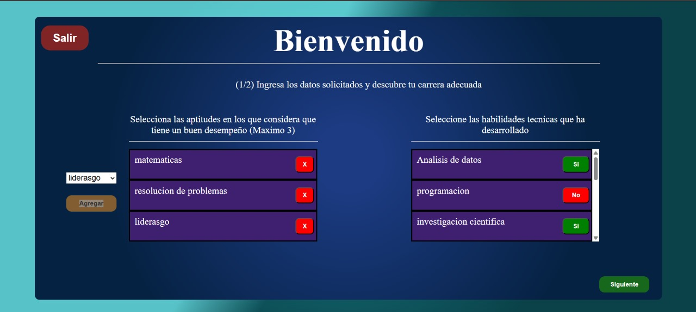
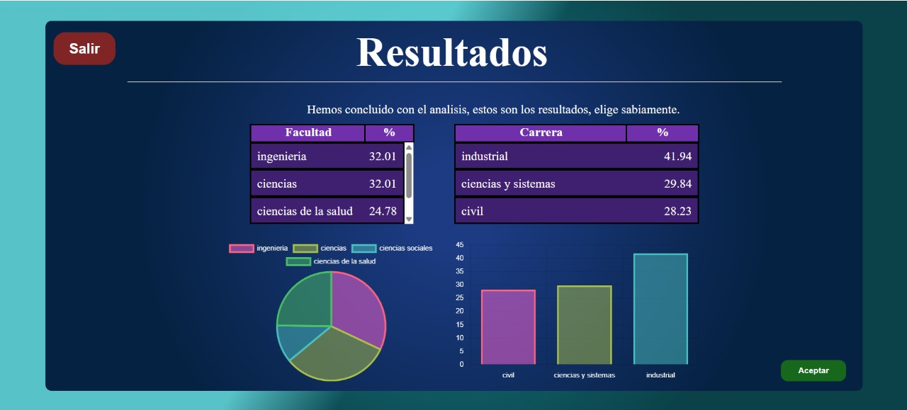
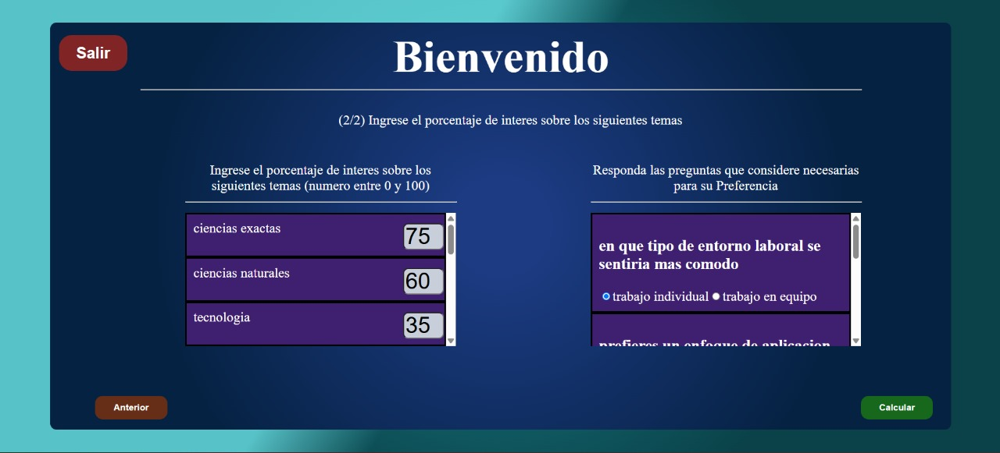
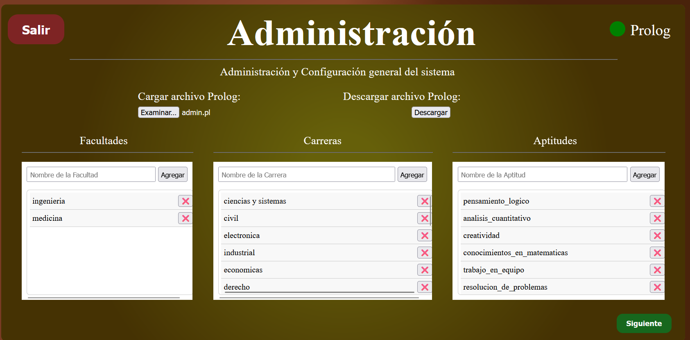
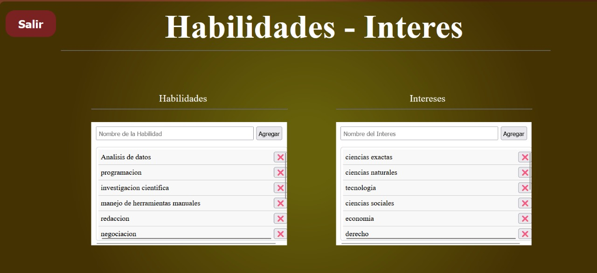
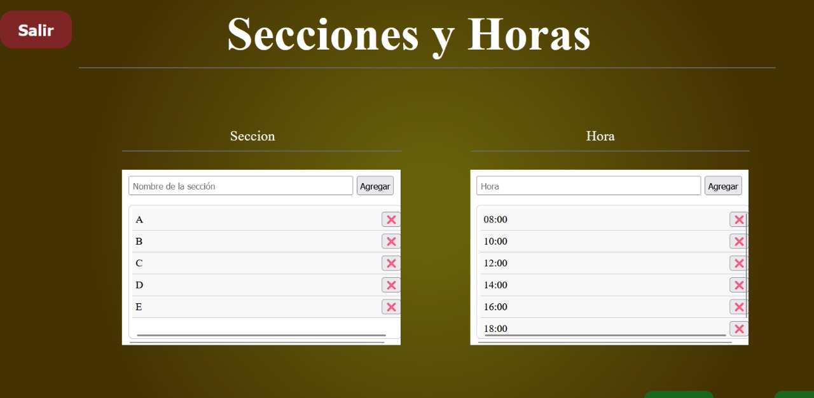
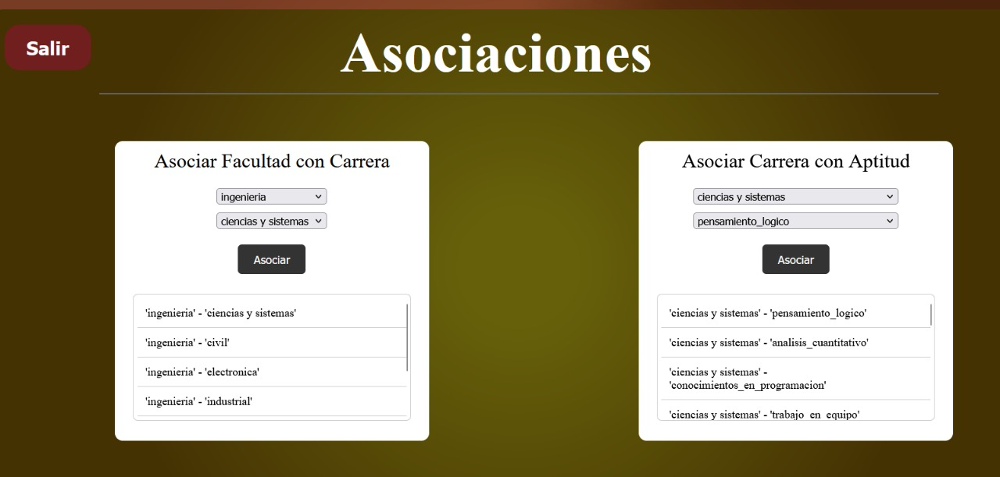
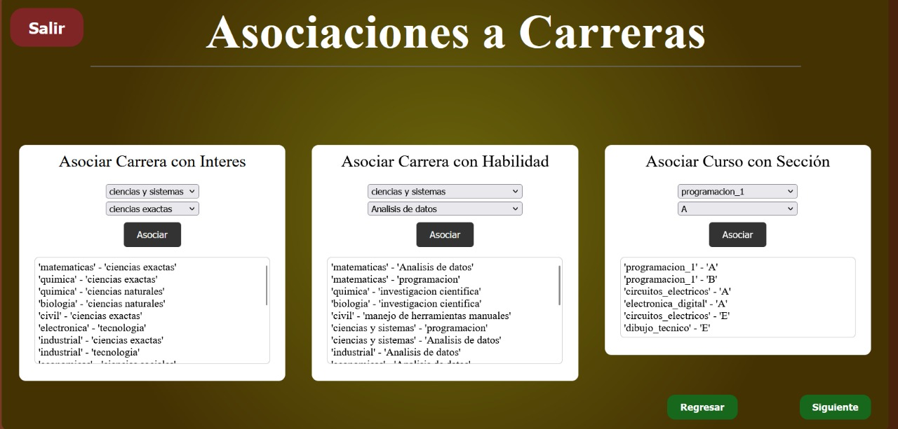
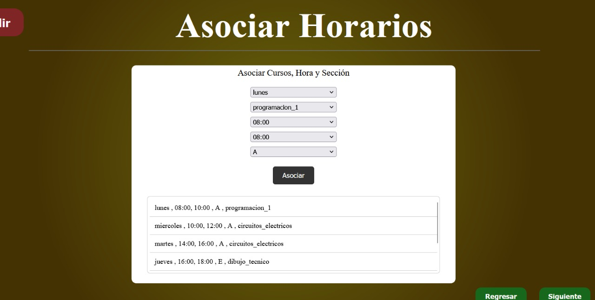

#### Universidad de San Carlos de Guatemala
#### Facultad de Ingeniería
#### Escuela de Ciencias y Sistemas
#### Inteligencia Artificial
#### Ing. LUIS FERNANDO ESPINO BARRIOS
#### Auxiliar: ROBIN OMAR BUEZO DÍAZ
       

<strong> Proyecto 1: UniMatch  
</strong>

       

| Nombre                              | Carnet    |
| :---:                               |  :----:   |
| Eduardo Alexander Reyes Gonzalez    | 202010904 |
| Pedro Martin Francisco              | 201700656 |
| Luis Antonio Cutzal Chalí           | 201700841 |

# Módulo de Inicio (Login)
- Objetivo: Permitir el acceso al sistema y redirigir a los usuarios al módulo correspondiente.
## Acceso a la Pantalla de Inicio:
Al ingresar al sistema, se verá una pantalla de bienvenida con información general sobre el propósito del sistema y cómo puede ayudarte a seleccionar la carrera más adecuada.
- Navegación:
    - Desde la pantalla de inicio, puedes seleccionar uno de los siguientes botones:
    - Iniciar sesión como estudiante: Si eres estudiante, haz clic aquí para acceder al módulo de estudiantes.
    - Iniciar sesión como administrador: Si eres administrador, haz clic en este botón para acceder al módulo administrativo.
- Validación de Credenciales:
    - Para acceder como administrador, deberás ingresar las credenciales predefinidas.
    - Si las credenciales son correctas, serás redirigido al Módulo Administrativo.
    - Si no eres administrador y solo deseas acceder como estudiante, selecciona la opción de estudiante sin necesidad de credenciales.

# Imagenes del módulo de inicio

# Módulo de Estudiantes
- Objetivo: Ayudar a los estudiantes a encontrar la carrera que mejor se adapte a sus aptitudes y habilidades, y planificar su horario de cursos.

## Formulario de Entrada:
- Una vez dentro del módulo de estudiantes, serás recibido por un formulario donde podrás ingresar tus aptitudes, habilidades e intereses:
    - Utiliza las listas desplegables o casillas de verificación (checkboxes) para seleccionar las opciones que describen mejor tus características.
    - También podrás definir tus niveles de afinidad con cada aptitud o habilidad utilizando escalas de bajo, medio o alto.
## Solicitar Análisis de Compatibilidad:
- Después de completar el formulario, haz clic en el botón "Solicitar Análisis".
- El sistema procesará tu información y generará una lista de facultades y carreras recomendadas que se ajustan mejor a tu perfil.
## Visualización de Resultados:

- El sistema te mostrará una lista de facultades y carreras recomendadas, ordenadas por el nivel de compatibilidad con tu perfil.
- También podrás ver gráficos que muestran la relación entre tus aptitudes, habilidades e intereses y las opciones académicas recomendadas.
## Planificación de Horarios:

- A continuación, podrás seleccionar los cursos que más te interesen dentro de las facultades recomendadas.
- El sistema te sugerirá un horario óptimo basado en la disponibilidad de los cursos y tus preferencias de horario.
- Los resultados de la planificación se mostrarán en una tabla organizada, facilitando la visualización de tu horario ideal.

# Imagenes del módulo administrador

# Módulo Administrativo
- Objetivo: Permitir a los administradores gestionar todas las opciones académicas, aptitudes, habilidades, intereses, cursos y reglas del sistema.

## Acceso al Módulo Administrativo:

- Este módulo está disponible solo para administradores.
- Para ingresar, debes proporcionar las credenciales correspondientes (usuario y contraseña).
- Si las credenciales son correctas, serás redirigido a un panel de administración.
## Gestión de Facultades y Carreras:

- Desde el panel de administración, puedes agregar, editar y eliminar facultades y carreras:
    - Agregar facultad/carrera: Haz clic en el botón "Agregar", completa el formulario con el nombre y descripción, y luego confirma la adición.
    - Editar facultad/carrera: Haz clic en el ícono de edición junto a la facultad o carrera que deseas modificar, cambia los datos y guarda los cambios.
    - Eliminar facultad/carrera: Haz clic en el ícono de eliminación junto a la facultad o carrera que deseas quitar del sistema.
## Gestión de Aptitudes, Habilidades e Intereses:

- Aquí puedes agregar, editar o eliminar aptitudes, habilidades e intereses que los estudiantes podrán seleccionar en sus formularios:
    - Agregar característica: Haz clic en "Agregar" e ingresa los detalles de la nueva aptitud, habilidad o interés.
    - Editar característica: Selecciona la aptitud, habilidad o interés que deseas cambiar y edítalo.
    - Eliminar característica: Haz clic en el ícono de eliminar junto a la aptitud, habilidad o interés que desees eliminar.
## Gestión de Cursos y Horarios:

- Puedes gestionar los cursos y horarios de cada facultad:
    - Agregar curso: Haz clic en "Agregar Curso", completa el formulario con la información del curso (nombre, descripción, horario), y asigna el curso a la facultad correspondiente.
    - Editar curso: Selecciona el curso que deseas modificar y haz los cambios necesarios.
    - Eliminar curso: Haz clic en el ícono de eliminar junto al curso que ya no será ofrecido.
## Carga y Descarga de Archivos .pl:

- Los archivos .pl contienen las reglas del sistema en formato Tau-Prolog, las cuales se utilizan para procesar la información de los estudiantes.

- Para cargar un nuevo archivo .pl:

    - Haz clic en "Cargar archivo .pl".
    - Selecciona el archivo .pl desde tu dispositivo y cárgalo.
## Para descargar el archivo .pl actualizado:

- Después de realizar las modificaciones necesarias en las facultades, carreras, aptitudes o cursos, puedes descargar el archivo actualizado.
- Haz clic en "Descargar archivo actualizado" y guarda el archivo en tu dispositivo.

# Imagenes del módulo administrador

